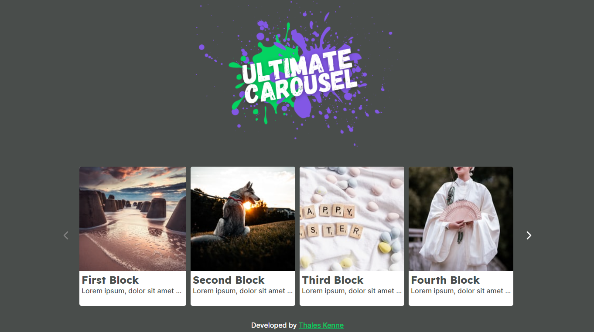

# Ultimate Carousel - Thales Kenne

Ultimate Carousel is a simple application with a custom built carousel, featuring a 4 block carousel with scroll animations.

### :cd: Technologies and Features

- Reactjs
- Functional components
- Json Server
- CSS Modules
- Hooks

### :sunglasses: Reasoning behind features

- In normal applications I'd build a custom hook with Context API to fetch the server information, rather than straight inside the component. I just didn't see the point in doing that here since it is a single component.

- I created a local json server to provide the application with a mock backend to simulate an actual request using axios. 

- I used CSS modules to decouple each component from each other, since I'm actually more used to Sass. Css  modules at least brought me closer to my comfort zone. Although adding sass would be easy, I chose not to add another layer of "complexity".

- I chose to go for a more artsy vibe with the logo and images. Just adding my "soul" to the project. All the images were generated using a custom endpoint from Unsplash.

- The images displayed in the cards are chosen on the first render and do not change while the app is running. They will be chosen randomly when the component mounts.

- The carousel will disable the arrows accordingly when it reaches the beggining/end of contents.

- The carousel will only scroll the necessary amount when there are not enough items to fill a 4-item scroll.

### :exclamation: Known issues

- I went for hard coded dimensions, since no other feature was requested. Although it should look fine on most pc displays, mobile is not included in this project.

- It is currently fixed to show 4 cards at a time. Further work would be necessary to make that value dynamic.
### :computer: Instructions to run

- Run `yarn` or `npm install` to install dependencies
- Run `yarn server` or `npm run server` to start the Json Server at port `:3333`
- Run `yarn start` or `npm run start` to start the application on port `:3000`

### :camera: Preview

